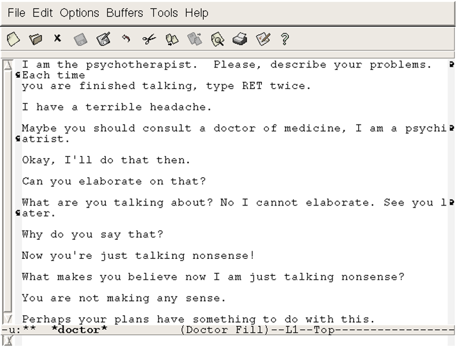
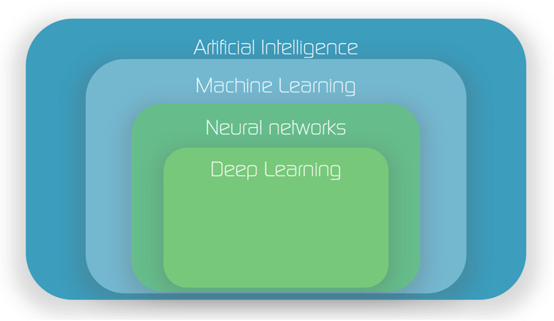
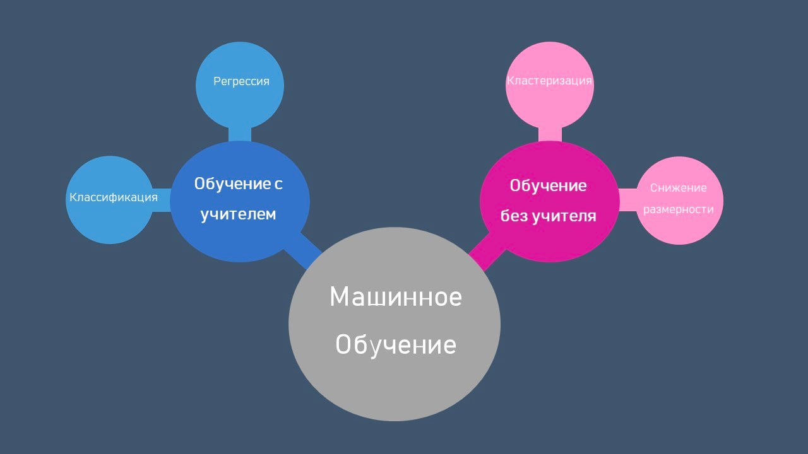

# Задание 02 — Введение в машинное обучение
## Машинное обучение

По итогам этого проекта ты сможешь построить модель машинного обучения для задачи классификации, предварительно обработав данные.

## Оглавление
1. [Глава I](#глава-i) \
    1.1. [Преамбула](#преамбула)
3. [Глава II](#глава-ii) \
    3.1. [Цели](#цели)
4. [Глава III](#глава-iii) \
    4.1. [Задание](#задание)
5. [Глава IV](#глава-iv) \
    5.1. [Сдача работы и проверка](#сдача-работы-и-проверка)

## Глава I
### Преамбула

Наверное, тебе встречалось довольно много разных терминов из сферы анализа данных: искусственный интеллект, машинное обучение, нейронные сети, глубокое обучение. Но чем отличаются друг от друга все эти термины и отличаются ли? 

На самом деле, каждый последующий термин из этого списка является подмножеством предыдущего. 

То есть самый широкий термин из всех перечисленных — искусственный интеллект. Он включает в себя любые техники и алгоритмы, которые способны имитировать человеческое поведение. Это могут быть алгоритмы машинного обучения, а могут быть просто правила, написанные на любом языке программирования в духе «if-then-else». 

Например, еще в 1966 году был создан виртуальный собеседник Элиза, которая имитировала диалог с психотерапевтом. В большинстве случаев она просто перефразировала то, что говорил человек. Иногда она находила ключевые слова, к которым были привязаны специальные реплики. Несмотря на то что в программе не использовалось никаких нейронных сетей или алгоритмов машинного обучения, ее можно считать ранним вариантом искусственного интеллекта. 

Та же современная Алиса от Яндекса отчасти построена на тех же принципах и правилах, хотя и использует уже алгоритмы машинного обучения.

Что же такое машинное обучение? Машинное обучение включает в себя статистические алгоритмы, которые автоматизируют процесс создания этих самых правил: их больше не надо прописывать вручную. 

Например, обученная модель способна сама распознавать эмоциональное состояние человека по реплике. Реплики могут быть разными, содержать множество разных ключевых слов, но модель способна почти во всех из них правильно определить эмоциональную окраску и соответствующим образом среагировать.

Подмножеством алгоритмов машинного обучения являются нейронные сети. Создатели этих алгоритмов вдохновлялись тем, как устроен человеческий мозг (тем не менее, нейронные сети достаточно далеки от полного подобия).

А подмножеством нейронных сетей являются алгоритмы deep learning. Это тоже нейронные сети, но обладающие большим количеством слоев (большим количеством уровней иерархии). По этой причине они называются «глубокими».

## Глава II
### Цель

Этот и следующий проекты могут быть сложными для понимания. Мы непосредственно подошли к предиктивному анализу, в центре которого лежат алгоритмы машинного обучения. «Под капотом» у них заложена серьезная математика, в которую мы сильно вдаваться не будем: чтобы ездить на автомобиле, совсем необязательно знать, как устроен двигатель внутреннего сгорания.
 
При этом мы заложили в материал моменты, которые помогут тебе интуитивно понять примерный способ работы этих алгоритмов.

## Глава III
### Задание

Машинное обучение можно разделить на две части: с учителем и без учителя.

**Обучение без учителя** — это раздел машинного обучения, в котором модель обучается на неразмеченных данных. В этом случае модель сама ищет закономерности и паттерны в данных без предоставления конкретных ответов или меток. Существует несколько методов обучения без учителя, включая кластеризацию, понижение размерности, поиск аномалий и многие другие. 

Вот некоторые из наиболее распространенных методов обучения без учителя:

* **Кластеризация** — метод для группирования данных в кластеры на основе их сходства.
* **Понижение размерности** — метод, позволяющий уменьшить количество признаков в данных, сохраняя при этом наиболее важные характеристики. 
* **Поиск аномалий** — метод для выявления аномальных данных из генеральной совокупности.

Обучение без учителя широко применяется в таких областях, как анализ данных, кластеризация пользователей, поиск аномалий, сегментация рынка и другие. Оно позволяет извлекать ценную информацию из данных, даже если нет четких ответов или меток для обучения модели.

**Обучение с учителем** — это другой основной подход в машинном обучении, при котором модель обучается на размеченных данных, где каждый пример имеет соответствующий выходной ответ или метки. В обучении с учителем модель учится на основе предоставленных пар «вход-выход» и стремится к минимизации ошибки между предсказанным и истинным значениями.

Задачи обучения с учителем разделяются на:

* **Классификацию** — метод для прогнозирования категориальных выходных значений. 
Например, модель определяет, является ли электронное письмо спамом или не спамом.
* **Регрессию** — метод для прогнозирования непрерывных выходных значений. Например, модель предсказывает цены недвижимости на основе характеристик дома.

Обучение с учителем широко применяется в различных областях, таких как финансы, медицина, маркетинг, обработка естественного языка и другие. Оно позволяет создавать модели, способные делать точные прогнозы и принимать решения на основе имеющихся данных и меток.

Ну, достаточно теории, давай перейдем к заданию!

Материалы проекта ждут тебя по [ссылке](https://gitverse.ru/rgordeev/tvgu-masters-26-2024-task-02). Напомним, что ты продолжаешь работать на платформе Kaggle. MS Excel по-прежнему под запретом.

Перед нами стоит задача классификации. Нам нужно научиться оценивать вероятность того, что пользователь перестанет пользоваться нашими услугами. У тебя есть данные о клиентах, и тебе известны пользователи, которые ранее прекращали пользоваться нашими услугами. Машина, глядя на эти данные, должна найти закономерности и создать модель, предсказывающую отток клиентов по имеющимся данным. Помимо этого, тебе нужно будет измерить качество модели. 

Для этого разобьем датасет на две части: обучающую выборку (train) и тестовую (test). На обучающей выборке алгоритм будет учиться, а на тестовой мы проверим его реальную точность — на тех примерах, которые алгоритм еще не видел. Ведь суть построения модели заключается в том, чтобы она дальше встроилась в один из реальных процессов, где ранее решение о незнакомых данных принималось каким-то другим алгоритмом (например, оценка человека, работающего с данными), не имея априорной информации о целевом значении. 

Но перед этим нам придется еще поработать с предобработкой данных. Алгоритмы машинного обучения в этом смысле бывают достаточно привередливыми.

## Задание 1
Удали признаки с приставками `charg_inst`, `charg_sale`, `hgid`, `hflat`, `hlid`, а также данные о координатах `latitude_1m` и `longitude_1m`. В удалении признаков тебе поможет метод 
[.drop](https://pandas.pydata.org/docs/reference/api/pandas.DataFrame.drop.html).

Выведи размерность получившейся таблицы.

## Задание 2
Теперь разберемся, что в каждой из задач для нас будет являться признаком (Х), а что предсказываемой переменной (Y).

Раздели датасет `train` на признаки и предсказываемую величину. Признаки сохрани в переменную `X`, а предсказываемую величину — в переменную `Y`. 

Выведи размерность `X` и `Y`.

## Задание 3
Теперь нам потребуется разделить наши признаки на численные и категориальные. В этом нам поможет метод [.select_dtypes](https://pandas.pydata.org/docs/reference/api/pandas.DataFrame.select_dtypes.html). 

Численные переменные имеют тип `'number'`, а категориальные `'object'`. Численные переменные сохрани в переменную X_num, а категориальные — в переменную X_cat.

Выведи размерность этих таблиц.

## Задание 4
Некоторые алгоритмы машинного обучения чувствительны к пропускам данных, поэтому нам придется чем-то заполнить отсутствующие данные. Воспользуйся методом [fillna](https://pandas.pydata.org/docs/reference/api/pandas.DataFrame.fillna.html), для того чтобы заполнить пропуски в численных признаках значением 0.

Затем выполни этот код `X_num.isna().sum().sum()`.

## Задание 5
Примени преобразования **One-Hot Encoding** для категориальных признаков. В этом тебе поможет функция [pd.get_dummies](https://pandas.pydata.org/docs/reference/api/pandas.get_dummies.html)

Выведи размерность получившейся таблицы.

## Задание 6
Теперь уже преобразованные части требуется снова объединить в единый датасет. Соедини переменные `X_num` и `X_cat` в переменную `X`. Воспользуйся методом [merge](https://pandas.pydata.org/docs/reference/api/pandas.DataFrame.merge.html). Объединение проведи по индексам таблицы.

Выведи размерность получившейся таблицы.

## Задание 7
Раздели итоговый датасет на train и test части. В этом тебе поможет функция [train_test_split](https://scikit-learn.org/stable/modules/generated/sklearn.model_selection.train_test_split.html). Разделение проведи с параметрами `test_size=0.2`, `random_state=21`.

Выведи размерности переменных `X_train` и `X_test`.

## Задание 8
Рассчитай точность обученной модели. Для этого с помощью метода `.predict(X_test)` сделай предсказание на тестовой выборке `X_test`. Затем передай предсказанные классы и истинные значения оттока в функцию `accuracy_score`. 

Не подозрительный ли получился результат? Рассчитай долю клиентов, которые **не уйдут**.

## Задание 9
Рассчитай метрику ROC-AUC. Для этого с помощью метода `.predict_proba(X_test)[:,1]` сделай предсказание на тестовой выборке `X_test`. Затем передай вероятности класса и истинные значения оттока в функцию `roc_auc_score`. 

## Глава IV
### Сдача работы и проверка

1. Сохрани решения в файле `day-02-assignment.ipynb`.
2. Сделай форк исходного репозитория на github
3. Закоммить изменения
4. Опубликуй изменения в своем форке
5. Сделай пулл реквест на исходный репозиторий. В комментарии пулл реквеста укажаи свое ФИО и группу